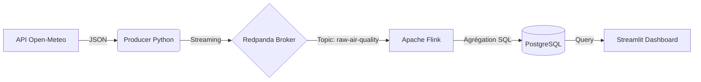

# 🌍 Pipeline de Streaming Big Data : Surveillance de la Qualité de l'Air


> **Projet de Master 2 MIASHS - Architecture Big Data & Streaming**
>
> *Ce dépôt contient l'intégralité du code source, de l'infrastructure et de l'analyse technique du projet.*

---

## 📑 Table des Matières
1. [Introduction et Objectifs](#-1-introduction-et-objectifs)
2. [Architecture Technique](#-2-architecture-technique)
3. [Implémentation et Choix Techniques](#-3-implémentation-et-choix-techniques)
4. [Analyse des Performances (Livrables)](#-4-analyse-des-performances-livrables)
5. [Guide d'Installation et Démarrage](#-5-guide-dinstallation-et-démarrage)
6. [Structure du Projet](#-6-structure-du-projet)

---

## 🧐 1. Introduction et Objectifs

La surveillance de la qualité de l'air est critique pour la santé publique. Les systèmes traditionnels (Batch) analysent les données avec trop de latence. L'objectif de ce projet est de construire une **pipeline de traitement en temps réel** capable de :
1.  **Ingérer** des flux de données simulés réalistes (API Open-Meteo).
2.  **Traiter** ces flux pour lisser les variations via des fenêtres temporelles (Windowing).
3.  **Visualiser** les résultats instantanément sur un dashboard interactif.

### 🎯 Livrables du projet
Ce projet répond aux exigences suivantes :
- [x] Application de Streaming complète.
- [x] Dashboard interactif temps réel.
- [x] Générateur de données synthétique et reproductible.
- [x] Évaluation de la latence et de la précision.

---

## 🏗 2. Architecture Technique

Nous avons opté pour une **Architecture Kappa** simplifiée, où toutes les données sont traitées comme un flux continu.

### Le Pipeline de Données

## Architecture

1.  **Source** : API Open-Meteo (Simulée par `producer.py`)
2.  **Broker** : Redpanda (Compatible Kafka)
3.  **Processing** : Apache Flink (Agrégations fenêtrées)
4.  **Storage** : PostgreSQL
5.  **Viz** : Streamlit

## Installation

### 1. Prérequis
* Docker & Docker Compose
* Python 3.8+

### 2. Installation des dépendances Python
```pip install -r requirements.txt```

### 3. Lancement de l'infrastructure
```docker-compose up -d```

### 4. Démarrage du Pipeline
## Étape 1 : Lancer le Job Flink
Le script Flink doit tourner à l'intérieur du conteneur Docker.

```docker exec -it flink-jobmanager bash```

# Une fois dans le conteneur :
```/opt/flink/bin/flink run -py /opt/flink/usrlib/processor.py```

(Vérifier sur http://localhost:8081 que le job est RUNNING)

## Étape 2 : Lancer le Producer (Données)
Ce script simule les capteurs et envoie les données vers Redpanda.

```python producer.py```

## Étape 3 : Lancer le Dashboard
```streamlit run dashboard.py```

## Accès

Streamlit Dashboard : http://localhost:8501

Flink Dashboard : http://localhost:8081

Redpanda Console : http://localhost:8080
